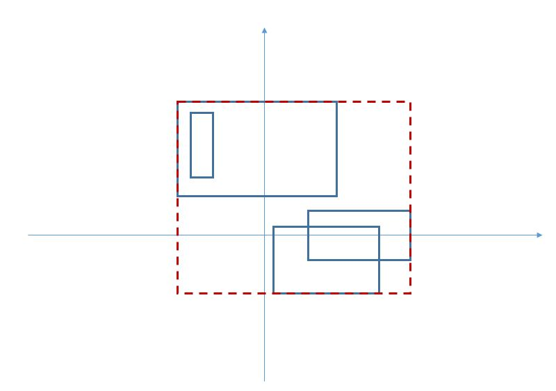

# spbstu-icst-programming-course

:arrow_upper_left: click the menu icon near file title for quick navigation with a table of content (GitHub feature)

This is my first time coding C#, hopefully it's decent heh.
My experience is mostly with C++ and Rust, so I doubt C# is much harder.

If you are here from my other repos with actual projects - leave. There is literally nothing of interest here.
C# is just Microsoft Java. 

## Projects

### Domino

Also known as "DominoC".

- Project: [domino](domino)
- [Assignment in moodle](https://dl.spbstu.ru/mod/assign/view.php?id=166538)
- [Task in PDF (moodle)](https://dl.spbstu.ru/mod/resource/view.php?id=166539)

Assignment as stated in moodle

> Задача: необходимо разработать модуль, который бы реализовывал логику игрока в домино.
>
> Разработка кода происходит на базе уже созданного проекта (см. архив, открываем файл Dominoes.sln).
>
> Модуль (MTable), который отвечает за саму организацию игры уже разработан и его изменять нельзя. Необходимо написать подпрограммы в модуле, которые отвечает за поведение игрока (MFPlayer и MSPlayer). Во время отладки можно просто дублировать код в этих двух модулях.
>
> Описание задания и некоторых особенностей в правилах игры в архиве (файл Domino.pdf).
>
> Пример готового приложения, которое имитирует игру двух модулей - файл DominoReady.exe. Здесь алгоритм в обоих модулях одинаковый и имеет очень простую логику - берется первая подходящая доминошка.
>
> Правила игры в классическое домино [можно найти здесь](http://ru.wikipedia.org/wiki/%D0%94%D0%BE%D0%BC%D0%B8%D0%BD%D0%BE).
> Отличия от классических правил описаны в [файле задания](https://dl.spbstu.ru/mod/resource/view.php?id=166539).
> Готовый модуль отправлять как ответ на задание (например, MFPlayer.cs). Сам отчет по курсовой работе загружается в отдельный контейнер.
>
> Задача участника турнира - разработать систему алгоритмов и реализовать на их базе функции, которые бы отвечали за тактику и стратегию игры так, чтобы переиграть подпрограмму в другом аналогичном модуле, написанным другим автором. Нет ограничения на количество разрабатываемых подпрограмм и на используемые структуры данных в модуля игрока. Однако нельзя изменять названия и описание уже данных функций.
>
> Скачать [архив с проектом и готовой программой](https://dl.spbstu.ru/pluginfile.php/329186/mod_assign/intro/DominoC.zip)...

### Enclosing rectangle

- Project: [enclosing-rectangle](enclosing-rectangle)
- [Assignment in moodle](https://dl.spbstu.ru/mod/assign/view.php?id=48191)

Assignment as stated in moodle

> #### Задание: Охватывающий прямоугольник
> Задайте структуру, которая бы описывала прямоугольник на плоскости. Предположить, что стороны прямоугольника параллельны осям. Координаты вершин - тип double.
> Разработайте функцию на вход которой подается массив прямоугольников (размер массива не более 1000). Функция должна возвращать прямоугольник, который бы охватывал все входящие в массив прямоугольники.
> 
> 

Пример

> 
> 
> 
> 

> 
> Разработайте функцию на вход которой подается массив прямоугольников (размер массива не более 1000). Функция должна возвращать прямоугольник, который бы охватывал все входящие в массив прямоугольники.

### Find N biggest

- Project: [find-n-biggest](find-n-biggest)
- [Assignment in moodle](https://dl.spbstu.ru/mod/assign/view.php?id=48150)

Assignment as stated in moodle

Kinda poorly worded but ok.

> #### ЗаданиеДоп: N наибольших
> Разработать функцию, которая определяет номера N наибольших элементов в  целочисленном массиве.
> 
> Известно, что все элементы массива положительны, и что N заведомо меньше размера массива.

